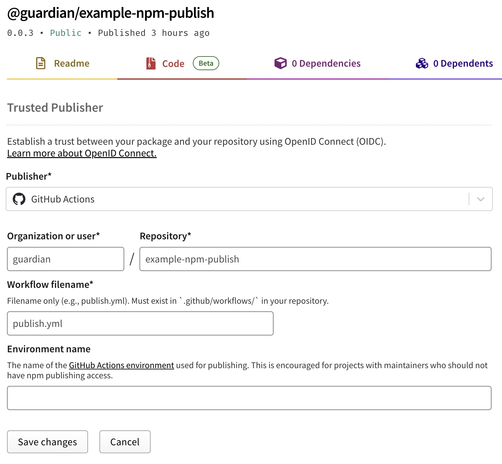

# [`@guardian/example-npm-publish`](https://www.npmjs.com/package/@guardian/example-npm-publish)

This repository is a reference example for publishing a package to NPM using GitHub Actions and [NPM's trusted publishers](https://docs.npmjs.com/trusted-publishers).
It is intentionally minimal to demonstrate the process and avoid the complexities of tooling such as TypeScript, Changesets, etc.

Want to try it? Update the version in `package.json` push and create a tag of format `v0.0.X`.

## Observations
### Creating a new package
Trusted publishing only works for existing packages.
If you want to create a new package, it needs to be published manually first.
As this is a one-off, we recommend doing this locally by:
1. Get an NPM token from TBD.
2. Make the NPM token available to the NPM CLI by creating an `.npmrc` file in your home directory:

    ```bash
    echo "//registry.npmjs.org/:_authToken=\${NPM_TOKEN}" > ~/.npmrc
    ```
   This file uses the `NPM_TOKEN` environment variable. Set it to the token you got in step 1:

    ```bash
    export NPM_TOKEN=???
    ```
3. Publish the package:

    ```bash
    npm publish --access public
    ```
   Your package should now be available on npmjs.com.

### Setting up trusted publishing
With a package already available on npmjs.com, there are some manual [steps](https://docs.npmjs.com/trusted-publishers) to set up trusted publishing.
This has to be done by one of the handful of restricted staff that can access the `@guardian` NPM organisation.

<details><summary>How this repository is configured</summary>
<p>

Below is a screenshot from https://www.npmjs.com/package/@guardian/example-npm-publish.



</p>
</details> 

Within the repository, the following requirements exist:
1. Use NPM version 11.5.1 or higher
2. The `name` field in `package.json` must match the package name on npmjs.com (e.g. `@guardian/example-npm-publish`)
3. The `repository.url` field in `package.json` must match GitHub repository (e.g. `https://github.com/guardian/example-npm-publish`)

## Tested scenarios
### When an older version of NPM is used
An HTTP 404 response is returned. For example:

> npm error 404 Not Found - PUT https://registry.npmjs.org/@guardian%2fexample-npm-publish - Not found
> npm error 404
> npm error 404  '@guardian/example-npm-publish@0.0.4' is not in this registry.

### When the workflow filename doesn’t match the one set on npmjs.com
An HTTP 404 response is returned. For example:

> npm error 404 Not Found - PUT https://registry.npmjs.org/@guardian%2fexample-npm-publish - Not found
> npm error 404
> npm error 404  The requested resource '@guardian/example-npm-publish@0.0.3' could not be found or you do not have permission to access it.

> [!NOTE]
> This also happens when using re-usable workflows 😔.

### When `repository.url` is not set in `package.json`
An HTTP 422 response is returned. For example:

> npm error 422 Unprocessable Entity - PUT https://registry.npmjs.org/@guardian%2fexample-npm-publish - Error verifying sigstore provenance bundle: Failed to validate repository information: package.json: "repository.url" is "", expected to match "https://github.com/guardian/example-npm-publish" from provenance

### When the `repository.url` doesn’t match the one set on npmjs.com
An HTTP 404 response is returned. For example:

> npm error code E404
> npm error 404 Not Found - PUT https://registry.npmjs.org/@guardian%2fexample-npm-publish - Not found
> npm error 404
> npm error 404  The requested resource '@guardian/example-npm-publish@0.0.4' could not be found or you do not have permission to access it.
